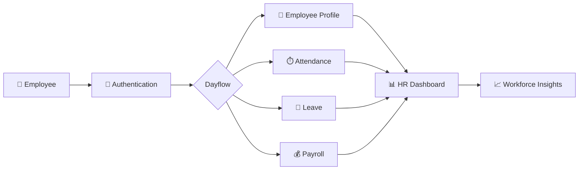

<div align="center">


<br/>


<br/>


<br/><br/>

**A modern HR platform built to bring people, processes, and productivity into one seamless flow.**

<br/>

<a href="#-features">Features</a>
  •   <a href="#-architecture">Architecture</a>
  •   <a href="#-tech-stack">Tech Stack</a>
  •   <a href="#-roadmap">Roadmap</a>

</div>

---

## ✦ The Idea Behind Dayflow

> **HR shouldn't feel like paperwork.**

Dayflow is a centralized Human Resource Management System designed to simplify the everyday operations of modern organizations.

From **employee management** and **attendance** to **leave management** and **payroll**, Dayflow connects essential HR workflows inside one digital ecosystem.

Instead of jumping between spreadsheets, forms, emails, and disconnected tools—

### **Dayflow brings everything into one flow.**

---

<div align="center">


### `PEOPLE → PROCESS → PRODUCTIVITY`

</div>

---

# ⚡ Why Dayflow?

<div align="center">

|      👥 People      |     ⏱️ Time    |   📊 Insights  |     🔐 Control    |
| :-----------------: | :------------: | :------------: | :---------------: |
| Employee Management |   Attendance   |  HR Dashboard  | Role-Based Access |
|       Profiles      |  Working Hours | Workforce Data |  Secure Workflows |
|     Departments     | Leave Tracking |  HR Analytics  |  Centralized Data |

</div>

---

# ✨ Features

<table>
<tr>
<td width="50%">

### 👥 Employee Management

Centralize employee information and make workforce management easier.

* Employee profiles
* Departments
* Designations
* Joining information
* Employment status
* Contact information

</td>

<td width="50%">

### ⏱️ Attendance

Turn everyday attendance into a simple digital workflow.

* Check-in / Check-out
* Attendance history
* Working hours
* Daily status
* HR monitoring

</td>
</tr>

<tr>
<td>

### 🌴 Leave Management

A streamlined workflow from leave request to approval.

* Leave application
* Approval / rejection
* Leave balance
* Leave history
* Request tracking

</td>

<td>

### 💰 Payroll

Bring salary-related information into one centralized space.

* Salary information
* Payroll records
* Salary components
* Payment status
* Payroll history

</td>
</tr>

<tr>
<td>

### 📊 HR Dashboard

Give HR teams a real-time overview of workforce operations.

* Employee statistics
* Attendance overview
* Leave requests
* Workforce activity
* Payroll information

</td>

<td>

### 🔐 Role-Based Access

Different users get access to the functionality they actually need.

* Admin / HR
* Employee
* Protected workflows
* Permission-based operations

</td>
</tr>
</table>

---

# 🧠 How Dayflow Works



---

# 🏗️ Architecture

```text
                         ┌─────────────────────────┐
                         │        DAYFLOW          │
                         │         HRMS            │
                         └────────────┬────────────┘
                                      │
                         ┌────────────▼────────────┐
                         │    Authentication       │
                         │     & Authorization      │
                         └────────────┬────────────┘
                                      │
             ┌────────────────────────┼────────────────────────┐
             │                        │                        │
             ▼                        ▼                        ▼
      ┌─────────────┐          ┌─────────────┐          ┌─────────────┐
      │  Employees  │          │ Attendance  │          │    Leave    │
      └──────┬──────┘          └──────┬──────┘          └──────┬──────┘
             │                        │                        │
             └────────────────────────┼────────────────────────┘
                                      │
                                      ▼
                              ┌───────────────┐
                              │ HR Dashboard  │
                              └───────┬───────┘
                                      │
                                      ▼
                              ┌───────────────┐
                              │    Payroll    │
                              └───────────────┘
```

---

# 🛠️ Tech Stack

<div align="center">

### Frontend


### Backend


### Database


### Tools


</div>

> Replace the icons above with your actual stack if your implementation differs.

---

# 📂 Project Structure

```text
dayflow-human-resource-management/
│
├── 📁 assets/
│
├── 📁 frontend/
│   ├── 📁 components/
│   ├── 📁 pages/
│   ├── 📁 services/
│   ├── 📁 styles/
│   └── App.*
│
├── 📁 backend/
│   ├── 📁 controllers/
│   ├── 📁 models/
│   ├── 📁 routes/
│   ├── 📁 middleware/
│   └── server.*
│
├── 📄 README.md
├── 📄 package.json
└── 📄 .gitignore
```

---

# 🔄 The Dayflow

<div align="center">

```text
                    ┌───────────────┐
                    │   EMPLOYEE    │
                    └───────┬───────┘
                            │
                            ▼
                    ┌───────────────┐
                    │    LOGIN      │
                    └───────┬───────┘
                            │
             ┌──────────────┼──────────────┐
             ▼              ▼              ▼
        👤 PROFILE      ⏱️ ATTENDANCE    🌴 LEAVE
             │              │              │
             └──────────────┼──────────────┘
                            │
                            ▼
                    ┌───────────────┐
                    │  HR DASHBOARD │
                    └───────┬───────┘
                            │
                            ▼
                    ┌───────────────┐
                    │    PAYROLL    │
                    └───────────────┘
```

</div>

---

# 📈 HR Operations at a Glance

<div align="center">


</div>

---

# 🎯 Design Philosophy

Dayflow is built around four principles:

### 01 — Simplicity

Complex HR operations should feel simple.

### 02 — Centralization

Employee information shouldn't be scattered across multiple systems.

### 03 — Transparency

Employees should have visibility into their own HR information.

### 04 — Scalability

The foundation should support increasingly complex organizational workflows.

---

# 🚀 Roadmap

```text
                         DAYFLOW ROADMAP
                               │
          ┌────────────────────┼────────────────────┐
          │                    │                    │
          ▼                    ▼                    ▼
      Employee             Attendance            Leave
      Management           Management           Management
          │                    │                    │
          └────────────────────┼────────────────────┘
                               │
                               ▼
                           Payroll
                               │
                               ▼
                      HR Analytics
                               │
                               ▼
                     Performance System
                               │
                               ▼
                       AI HR Insights
                               │
                               ▼
                      📱 Mobile App
```

### Planned Enhancements

* [ ] Advanced HR analytics
* [ ] Automated payslip generation
* [ ] Email notifications
* [ ] Real-time notifications
* [ ] Shift management
* [ ] Department management
* [ ] Performance management
* [ ] Workforce analytics
* [ ] AI-powered HR insights
* [ ] Mobile application

---

# 🧪 Development

Dayflow is currently under active development.

New modules, UI improvements, automation workflows, and HR capabilities are being continuously integrated.

```bash
git clone <repository-url>

cd dayflow-human-resource-management

# Install dependencies
npm install

# Start development server
npm run dev
```

---

# 🤝 Contributing

Contributions, ideas, and improvements are welcome.

```bash
# Create a feature branch

git checkout -b feature/your-feature

# Make your changes

git add .

# Commit

git commit -m "feat: add your feature"

# Push

git push origin feature/your-feature
```

Then open a Pull Request.

---

# ⭐ Support the Project

<div align="center">

If Dayflow helped you, inspired you, or you simply like the project:

### ⭐ Star the repository

### 🍴 Fork it

### 🛠️ Build on it

### 💡 Share your ideas

Every contribution helps Dayflow grow.

</div>

---

<div align="center">


### ⚡ DAYFLOW

**People. Process. Productivity.**

*Human Resource Management — reimagined.*

<br/>


</div>
